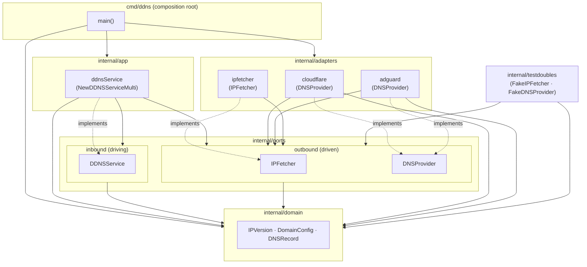

# Pingo architecture

## Purpose & context

Pingo is a lightweight **Dynamic DNS (DDNS) updater**. A single run discovers the
host's current public IPv4/IPv6 address and reconciles a configured set of DNS
records to match it — creating records that are missing and updating ones whose
content or proxy flag has drifted. It is designed to run as a scheduled job
(a Kubernetes `CronJob` in the homelab), driven entirely by environment
variables, with no persistent state of its own: the DNS providers are the source
of truth, and each run is an idempotent reconcile.

Two provider back-ends ship today:

- **Cloudflare** — authoritative public DNS records (`A`/`AAAA`) via the
  Cloudflare API.
- **AdGuard Home** (optional) — DNS *rewrites* on one or more internal resolvers,
  used to keep a split-horizon override pointed at the live public IP for LAN
  clients (e.g. a WireGuard endpoint caught by an internal `*.example.com`
  wildcard, so the handshake still works over NAT hairpin).

The public IP is discovered from Cloudflare's `cdn-cgi/trace` endpoint.

The codebase follows **hexagonal architecture (ports & adapters)** so the core
reconcile logic is isolated from — and testable independently of — the external
systems it talks to.

## Component & dependency diagram



All arrows point **inward** (toward the domain). Nothing in `domain`, `ports`, or
`app` imports an adapter; adapters and `cmd` sit on the outside.

## Run flow (end to end)

The composition root is [`cmd/ddns/main.go`](../../cmd/ddns/main.go). A single
invocation does:

1. **Load config** from environment variables — `CLOUDFLARE_API_TOKEN`,
   `DOMAINS` (comma-separated), `PROXIED`, and optionally `ADGUARD_URLS`
   (comma-separated) with `ADGUARD_USERNAME` / `ADGUARD_PASSWORD`. Each domain
   name expands into two `domain.DomainConfig` entries — one `IPv4` and one
   `IPv6`.
2. **Build adapters:** `cloudflare.NewAdapter(apiToken)` (always), zero or more
   `adguard.NewAdapter(url, user, pass, nil)` (when `ADGUARD_URLS` is set), and
   `ipfetcher.NewCloudflareTraceFetcher()`. Each DNS provider is wrapped in an
   `app.NamedProvider{Name, Provider}` so failures per sink are distinguishable
   in logs.
3. **Construct the service:** `app.NewDDNSServiceMulti(ipFetcher, providers, logger)`
   returns an `inbound.DDNSService`.
4. **Reconcile:** with a 30-second `context` deadline, `main` calls
   `ddnsService.UpdateDomains(ctx, configs)`. Inside
   [`internal/app/ddns.go`](../../internal/app/ddns.go):
   - `IPFetcher.GetIPv4` / `GetIPv6` are called **once**; the two addresses are
     shared across every provider and domain. If both fail, the run errors out;
     if only one is available, configs for the missing family are skipped.
   - Every `(provider, domain)` pair is reconciled **concurrently** (one
     goroutine each, `sync.WaitGroup`); errors are collected under a mutex and
     combined with `errors.Join`. One provider's failure never blocks the others.
   - `processDomain` is the reconcile unit: it calls
     `provider.GetRecords(ctx, name, recordType)` (`recordType` derived from
     `IPVersion.RecordType()` → `"A"`/`"AAAA"`). If no record exists it
     `CreateRecord`s; if one exists and its `Content`/`Proxied` already match, it
     no-ops; otherwise it `UpdateRecord`s the first match (logging a warning if
     several matched).
5. **Exit:** any joined error is logged and the process exits non-zero;
   otherwise it logs success. The job is expected to be re-run on a schedule.

## Ports & adapters map

Interfaces (ports) live under `internal/ports`, split into driving (inbound) and
driven (outbound) sub-packages. Concrete implementations (adapters) live under
`internal/adapters/<vendor>`.

| Port | Kind | Package | Interface | Implemented by |
|------|------|---------|-----------|----------------|
| `DDNSService` | Inbound (driving) | `internal/ports/inbound` | `UpdateDomains(ctx, []DomainConfig) error` | `app.ddnsService` (`internal/app`), constructed via `NewDDNSService` / `NewDDNSServiceMulti` |
| `IPFetcher` | Outbound (driven) | `internal/ports/outbound` | `GetIPv4(ctx)`, `GetIPv6(ctx)` | `ipfetcher.cloudflareTraceFetcher` (`internal/adapters/ipfetcher`); `testdoubles.FakeIPFetcher` in tests |
| `DNSProvider` | Outbound (driven) | `internal/ports/outbound` | `GetRecords`, `CreateRecord`, `UpdateRecord` | `cloudflare.adapter` (`internal/adapters/cloudflare`) **and** `adguard.adapter` (`internal/adapters/adguard`); `testdoubles.FakeDNSProvider` in tests |

Notes on the adapters:

- **cloudflare** — uses `github.com/cloudflare/cloudflare-go/v7`. Resolves the
  zone by walking domain labels most-specific → least-specific
  (`getZoneID`), then lists/creates/updates `A`/`AAAA` records. This is the only
  place the Cloudflare SDK types appear.
- **adguard** — talks to AdGuard Home's `/control/rewrite/{list,add,delete}`
  HTTP API with basic auth. Rewrites have no record IDs and no update verb, so
  the adapter maps the model onto `DNSProvider` by treating the stored **answer**
  as the record ID; `UpdateRecord` is therefore `delete(old answer)` +
  `add(new answer)`. `answerMatchesType` ensures an `A` reconcile never disturbs
  an `AAAA` rewrite.
- **ipfetcher** — fetches `https://1.1.1.1/cdn-cgi/trace` (v4) and the IPv6
  literal endpoint (v6), parsing the `ip=` line. A `WithClient` constructor
  exists for injecting a test server.

## The inward dependency rule

Imports flow **inward only**. Stated per layer:

- **`domain`** imports only the Go standard library — no other internal package,
  no third-party libraries.
- **`ports`** (`inbound`, `outbound`) may reference `domain` and nothing else
  internal.
- **`app`** depends on `domain` and the port interfaces (`inbound`, `outbound`);
  it must **not** import any adapter.
- **`adapters`** depend on `domain`, `ports` and `app` (in practice they import
  `domain` + `ports/outbound`); they translate between external systems and the
  domain.
- **`cmd`** is the composition root and may wire everything — it imports the
  adapters, `app`, and `domain` and injects the concrete adapters into the
  service.
- **`testdoubles`** implement the outbound ports (`domain` + `ports/outbound`)
  for unit tests and must not be imported by production code.

This rule is machine-enforced — see "Boundary guard" below.

## Boundary guard (go-arch-lint)

The dependency rule is enforced in CI by
[`go-arch-lint`](https://github.com/fe3dback/go-arch-lint), configured in
[`.go-arch-lint.yml`](../../.go-arch-lint.yml) (`version: 3`,
`allow.depOnAnyVendor: true` so only *internal* boundaries are policed). The
components map one-to-one onto the layout: `domain`, `ports-inbound`,
`ports-outbound`, `app`, `adapters`, `testdoubles`, `cmd`. Each component's
`mayDependOn` list encodes exactly the inward rule above (each also lists itself,
which permits external `_test` packages to import the package they exercise;
`domain` may depend on nothing but itself).

The CI `lint` job runs `go-arch-lint check`; the build fails on any boundary
violation. Run it locally with:

```
go install github.com/fe3dback/go-arch-lint@v1.16.0
go-arch-lint check
```

No known deviations: the guard is green against the current tree.

## External integrations

| System | Port | Direction | Notes |
|--------|------|-----------|-------|
| Cloudflare API | `outbound.DNSProvider` | Driven | DNS record CRUD via `cloudflare-go/v7`; needs `CLOUDFLARE_API_TOKEN`. |
| AdGuard Home API | `outbound.DNSProvider` | Driven | DNS-rewrite CRUD over HTTP basic auth; optional, one adapter per instance in `ADGUARD_URLS`. |
| Cloudflare trace (`1.1.1.1/cdn-cgi/trace`) | `outbound.IPFetcher` | Driven | Public IPv4/IPv6 discovery; no credentials. |

## Key design decisions

- **Ports split into `inbound`/`outbound`.** Driving vs. driven contracts live in
  separate packages, making the direction of control explicit at the import
  level.
- **`DNSProvider` is provider-agnostic.** AdGuard's ID-less rewrite model is
  adapted to the same three-verb interface as Cloudflare (answer-as-ID), so the
  app layer treats every sink uniformly and multi-provider fan-out is trivial.
- **Fetch IP once, reconcile many.** A single IP lookup feeds all providers and
  domains, and each `(provider, domain)` pair reconciles concurrently with
  independent error handling — a partial outage degrades gracefully rather than
  aborting the run.
- **Idempotent, stateless reconcile.** No local database; the run compares
  desired vs. actual and only writes on drift. Safe to run on a tight schedule.
- **Domain purity enforced mechanically**, not just by convention (go-arch-lint).

## Deployment

- The image is built and pushed by
  [`.github/workflows/image.yml`](../../.github/workflows/image.yml) on every push
  to `main` (and via `workflow_dispatch`): a multi-arch (`linux/amd64,linux/arm64`)
  image published to **`ghcr.io/gjcourt/pingo`**, tagged `YYYY-MM-DD` (UTC),
  `YYYY-MM-DD-<sha>`, and `latest`. `make image` remains a manual fallback.
- The homelab runs pingo as a Kubernetes **CronJob**. The deployment manifests
  live in the separate **homelab** repo (referenced from `AGENTS.md` as
  `../homelab/infra/controllers/pingo/`), where the CronJob pins the date tag;
  rolling forward means bumping that pinned tag in the homelab repo. Image-tag
  bumps must be coordinated with that deployment.
